# Intro to Web Development Workshop
### *June 7, 2017*
### Design Hub
---
This writeup is meant as a complement to an introductory web development workshop taught by Pitt Design Hub. It’s designed to give a formal starting point for beginners, and is meant to be used as a launchpad for getting more involved in web development. Cheers!

* [Introduction](#introduction)
  * [A Few Notes](#notes)
  * [The Web Stack](#the-web-stack)
  * [Browsers!](#browser)
* [Starting Points](#starting-points)
* [HTML](#html)
  * [Tags](#tags)
  * [The Head](#head)
  * [The Body](#body)
    * [Headings](#headings)
    * [Text](#texts)
    * [Links (Anchors)](#anchors)
    * [Unordered Lists and List Items](#lists)
    * [Images](#images)
    * [Divs](#divs)
    * [Comments](#comments)
* [CSS](#css)
  * [Getting Started](#getting-started-css)
  * [First Styling](#styling)
  * [Classes](#classes)
  * [More Useful Styling](#using-divs)
  * [The Wonderful World of CSS](#more-on-css)
* [Javascript](#javascript)
  * [A Rudimentary Example](#js-example)
  * [Going Further](#more-on-js)
* [Hosting](#hosting)
* [Next Steps](#next-steps)

## Introduction
The purpose of this workshop is for complete beginners to learn what it means to be a web developer. It should be noted, however, that web development is an incredibly expansive field; it spans across many domains, some that you wouldn’t even think included it. As such, web development includes a plethora of technologies and paradigms as well as is ever evolving -- meaning you there will always be more to learn. This writeup is simply the tip of the iceberg when it comes to web development!

### A Few Notes
First and foremost, this workshop isn’t designed to make a you a wizard at web development. Rather, it’s meant to be a starting block to dive into this insanely powerful and diverse field. With that said, a few things to consider before we get started:
* As with most programming, don’t worry to much about the semantics of syntax, the language, or whatever things you can easy Google -- Because well you can easily Google those things. The difficulty with web development isn’t remembering things, it’s being able to think like a developer. Focus more on the fundamentals and theories presented in this workshop rather than what the difference between a `<div>` and a `<p>` is.
* As said earlier, don’t be afraid to look things up. Google is a developer’s best friend, and once your done with this workshop, you’ll find there are hoards of online resources to use to continue learning.
* And finally, here are some developer headache saviors:
  * [Google](https://www.google.com)
  * [StackOverflow](http://www.stackoverflow.com)
  * [Tutorials Point](https://www.tutorialspoint.com)
  * [W3](https://www.w3schools.com)
  * [Mozilla Developer Network](https://developer.mozilla.org/en-US/docs/Web)
  * [Scotch.io](https://scotch.io)
  * And many more, these are just some of my favorites.

### The Web Stack
Before we get started with the nitty-gritty of HTML, CSS and Javascript, it’s important to understand what we mean by “the web” and what’s actually happening when you visit a webpage. If you’ve programmed before, you might be familiar with the concept of `abstraction`. If not, here’s a quick rundown.

As technology has involved, it’s become an incredibly complex array of machinery. Far more then we can process about at the same time. To help our feeble minds out, we separate these complex machines into chunks, called `abstraction layers` or `abstraction levels`. In essence, these layers hide functionality in a top down manner, that is an upper layer doesn’t need to know how a lower layer works in order to use it’s intended functions. For example, imagine your computer mouse. At some level, you might want to know basic details like: “What kind of sensor does this have? How many buttons does it have? Is it ergonomic?” But even in asking those questions you’re abstracting certain details: “How are the buttons manufactured? How does the sensor’s polling work?” Furthermore, this *basic* description of a mouse can be abstracted even further. As a user who just needs a mouse, you might not care about how many buttons it has, what kind of sensor it uses, or anything about its ergonomics. You might just be interested in: “Does it move my cursor around my screen and click on things?” This is another layer of abstraction. At its core, abstraction is one of the most powerful concepts in programming. It allows us to focus on only what we need to do, and saves us the headache for implementing details we might not care about. With abstraction, we only have to work on the things we need to get the job done.

The web itself can be referred to a tech `stack`. A stack, in this context is referred to anything composed as a series of abstraction layers, moving bottom up. What this means is that layers higher up on the stack, referred to as “high-level” technology, depend on the lower layers, called “low-level” technologies. These low-level technologies are responsible for implementation details of your application detail (imagine sensor polling, etc.). In web development, the `frontend` refers to what humans interact with and is at the top of the web stack. The frontend communicates with the `backend` which likewise communicates with even lower level technologies to encompass the entirety of your web app.  


> Credits to SitePoint.com, www.sitepoint.com/full-stack-developer

This workshop deals with the frontend side of web development. Frontend developers are focused on building web pages that are visually appealing and have sound user interfaces that are easy for people to navigate. However, as noted earlier, web development is much more expansive than just frontend developing, and can (and probably should) be explored further.

### Browsers!
Most of your are probably familiar with your Browser -- you’re using one to view this article right now. Formally defined, a Browser is a program that reads developer defined HTML, CSS, and Javascript and converts that into web pages that humans can see. As you get more engrossed into web development, you might run into browser specific quirks. Browsers can interpret code differently, and sometime will cause there to be different outcomes with the same code, introducing `compatibility issues`. However, we won’t worry about these things now, just know that they can happen.

## Starting Points
In this workshop we’ll be learning about HTML, CSS, and Javascript. Traditionally, we’d go over setting up a developing environment. But there are some fantastic tools on the web that allow us to enter code in our browser and lets you preview your work in realtime. For this workshop, we’ll be using `codepen` but other fantastic tools exists such as `JSFiddle`.

To get started, go to https://codepen.io/pen/. To get started, you don’t need to create an account. However, if you plan on doing a lot of your work in CodePen, it’s a good idea to create an account so you can save and build a portfolio of your work.

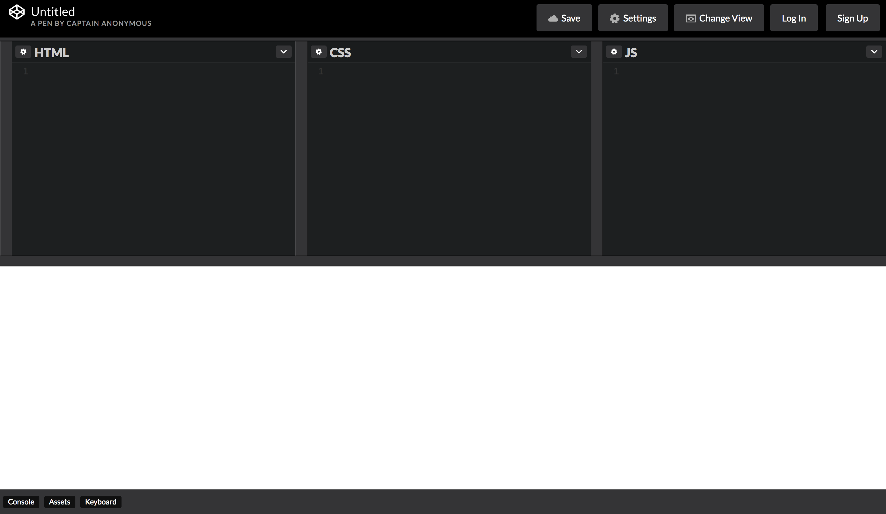

> https://codepen.io/pen/

Typing in the `HTML` pane will produce HTML. Typing in the `CSS` pane will similarly add CSS to your project. And typing in the `JS` pane will add Javascript to your project. The white space area is a preview of your work, and is update in real time.

> Note: if you plan on using CodePen a lot, get to know it’s interface and figure out what’s comfortable for you to work with.

## HTML
HTML refers to `Hyper-Text Markup Language`. HTML is what makes up the structure of your web page and likewise defines the content seen by humans that interface with the web page.

### Tags
`Tags` are the fundamental component to HTML. They are use to notate the variety of elements and rules that HTML allows for in your markup. Tags are delimited by `<` and `/>`.  HTML is littered with these two tags, that are called opening and closing tags respectively. In HTML, the following structure occurs for almost every tag:
```html
<></>
```
The `<>`  is the opening tag and the `</>` is the closing tag. This tells HTML what kind of element you want to place in the markup, and then when you’re done with that element.

The first tag that we should start with is the `html` tag.
```html
<html lang=“en”>
</html>
```
These tags tell the browser that we’re making an HTML page. The attribute, `lang` defines a  `property` of that tag. In this case, it tells the browser that this particular HTML page is in English, which is useful for things like Google to be able to convert it to different languages, for example.  `<html lang=“en”>` is the opening tag, and `</html>` is the closing tag. Anything between these two tags will be inside our HTML page.

Within the `html` tag, there are two essential tags that should be in the markup: `head` and `body`.
```html
<html lang=“en”>
  <head>
  </head>
  <body>
  </body>
</html>
```

### The Head
The `head` tag contains metadata about your HTML document as well as styling, scripts, and other information (such as the title of that given page).
```html
<html lang=“en”>
  <head>
    <title>My Awesome Web Page</title>
    <link rel=“stylesheet”     href=“https://cdnjs.cloudflare.com/ajax/libs/twitter-bootstrap/4.0.0-alpha.6/css/bootstrap.min.css”/>
    <script src="https://ajax.googleapis.com/ajax/libs/jquery/3.2.1/jquery.min.js"></script>
  </head>
  <body>
  </body>
</html>
```
You might notice the `title` tag here. When you first loaded the web page without the tag, in your browser you would see a random file path or url. The `title` tag indicates what the name of your web page is; with it added you can see the name of your web page on the tab of your browser.

There are two other important tags we introduced here, `link` and `script`.  Let’s focus on `link` first. The first thing that stands out is that `link` doesn’t have a closing tag. In fact, `link` doesn’t need one; it is closed like so: `<link />`, and that’s it. This tag is known as a self-closing tag. In HTML, there are a few other tags that are self-closing, but we won’t worry about those right now. Just know if you come across a tag that lacks a closing tag and it works as expected, then it most likely is a self-closing tag.

The `link` tag here is used to add a bit of styling to our HTML page. We’re using a fantastic CSS framework called [Twitter Bootstrap](http://getbootstrap.com/). It provides some in-box styles for you to use that look quite nice and can get a website to look pretty good in a short amount of time and effort. Checkout their documentation [here](http://getbootstrap.com/components/). With that aside, let’s dive into the guts of the `link` tag first. The `link` tag indicates to the browser that there’s another file associated with this HTML page. `rel=stylesheet` indicates that this file defines styling for the HTML page, and `href=` tells the browser whether the file can be found at (`href` refers to hyper-text reference).

> In CodePen, adding bootstrap is relatively simple. Click the cog icon next to CSS, and in the Quick-add dropdown, select Bootstrap.

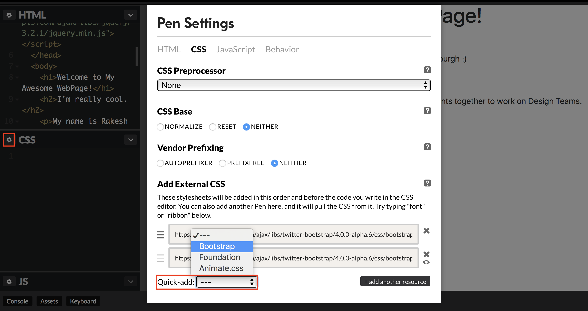

Lastly, let’s talk about the `script` tag. It’s used to add Javascript to your HTML page. The `src` attribute is a pointer to where your scripts are located and tells the browser to load and add them to your webpage so that they’re available to your other Javascript code and to your HTML page itself.

> Note: You can write Javascript directly in the script tag, but it’s generally good practice to write it in a separate file (*.js*) and load it into your HTML page in much of the same way we loaded this library; we’ll touch more on this in the [Javascript](#js) section.

Here we’re loading a library called jQuery. While a lot of developers will scoff and cringe at the use of jQuery, at a beginner standpoint it provides a suite of easy-to-use tools to interface with your HTML elements. It should be noted that jQuery **is not** a form of javascript -- learning only jQuery does not mean you understand Javascript. jQuery is a large, chunky file that can significantly slow down your applications, and so you should learn and understand Javascript on a fundamental level, so that when you’re experienced enough you don’t need to rely on jQuery or any other Javascript framework, library, etc.

> Note: Similarly to Bootstrap, adding jQuery is relatively simple in CodePen. This time, click the cog next to JS and under the drop down for Quick-add, select jQuery.

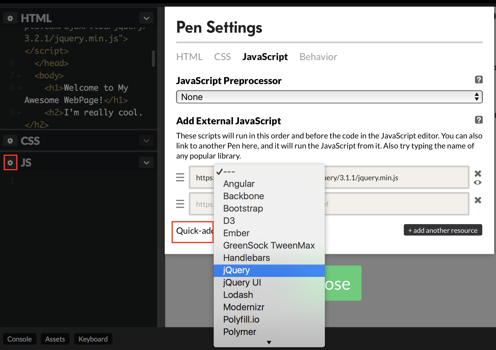

### The Body
As you might recall, there was one another required tag for your HTML, `body`. The body is where all the content of your HTML page will go, and, as such, is where you will be spending most of your time when working in HTML.

### Headings
In HTML, `headings` allow you to create section titles of varying size and emphasis. There are 6 tags, each with varying size that are delimited by `h` + `1-6`.

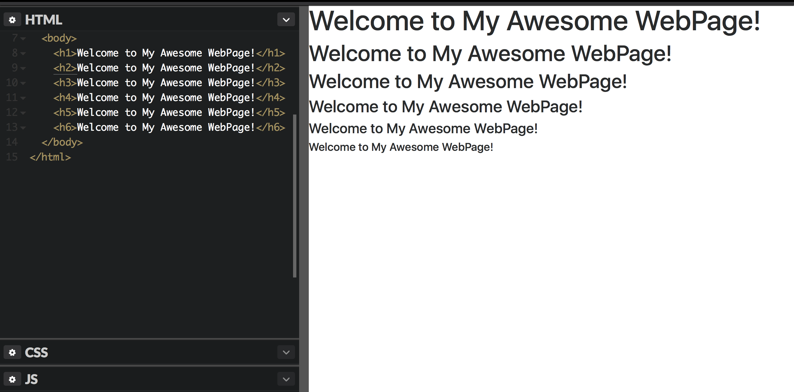

Let’s fill this webpage with some headings now:
```html
<html lang=“en”>
  <head>
  <title>My Awesome Web Page</title>
    <link rel=“stylesheet” href=“https://cdnjs.cloudflare.com/ajax/libs/twitter-bootstrap/4.0.0-alpha.6/css/bootstrap.min.css” />
    <script src="https://ajax.googleapis.com/ajax/libs/jquery/3.2.1/jquery.min.js"></script>
  </head>
  <body>
    <h1>Welcome to My Awesome WebPage!</h1>
    <h2>I’m really cool.</h2>
    <h2>I like cool things.</h2>
  </body>
</html>
```

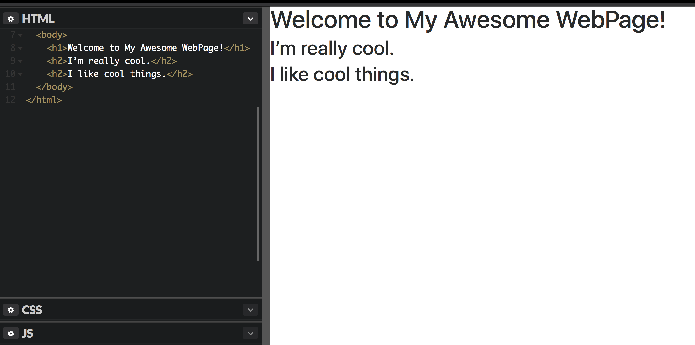

### Text
Now that we have defined sections, let’s add some text to continue filling content. In HTML, we can simply type to add content:
```html
<html lang=“en”>
  <head>
    <title>My Awesome Web Page</title>
    <link rel=“stylesheet” href=“https://cdnjs.cloudflare.com/ajax/libs/twitter-bootstrap/4.0.0-alpha.6/css/bootstrap.min.css” />
    <script src="https://ajax.googleapis.com/ajax/libs/jquery/3.2.1/jquery.min.js"></script>
  </head>
  <body>
    <h1>Welcome to My Awesome WebPage!</h1>
    <h2>I’m really cool.</h2>
    My name is Rakesh Chatrath and I’m a sophomore here at the University of Pittsburgh :)
    <h2>I like cool things.</h2>
    Design Hub is super cool. We do cool things like workshops as well as pair students together to work on Design Teams. Check us out ;)
  </body>
</html>
```
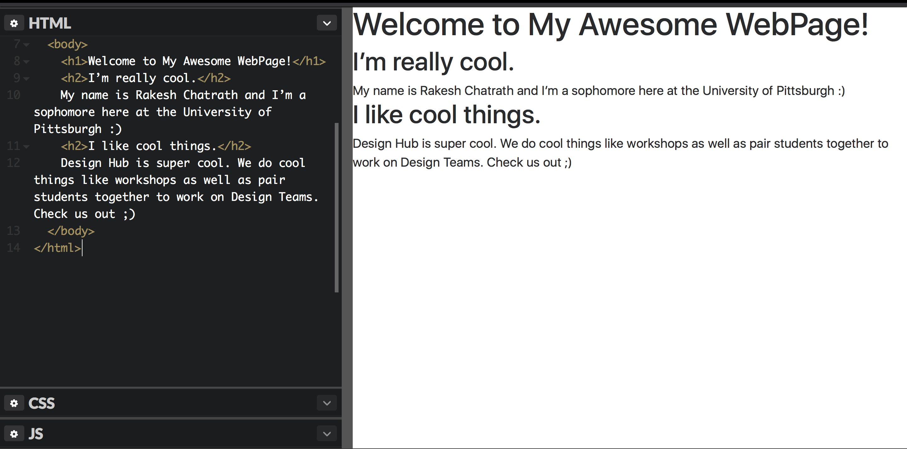

However, this is generally bad practice. HTML provides a `paragraph` tag, delimited as `<p>`. It’s generally much better practice to wrap all your text in “p” tags, so that  each paragraph has a clearly defined section in your HTML page, as well as later on so that individual paragraphs can be targeted by CSS (more on this later). Let’s fix our code.
```html
<html lang=“en”>
  <head>
    <title>My Awesome Web Page</title>
    <link rel=“stylesheet” href=“https://cdnjs.cloudflare.com/ajax/libs/twitter-bootstrap/4.0.0-alpha.6/css/bootstrap.min.css” />
    <script src="https://ajax.googleapis.com/ajax/libs/jquery/3.2.1/jquery.min.js"></script>
  </head>
  <body>
    <h1>Welcome to My Awesome WebPage!</h1>
    <h2>I’m really cool.</h2>
    <p>My name is Rakesh Chatrath and I’m a sophomore here at the University of Pittsburgh :)</p>
    <h2>I like cool things.</h2>
    <p>Design Hub is super cool. We do cool things like workshops as well as pair students together to work on Design Teams. Check us out ;)</p>
  </body>
</html>
```
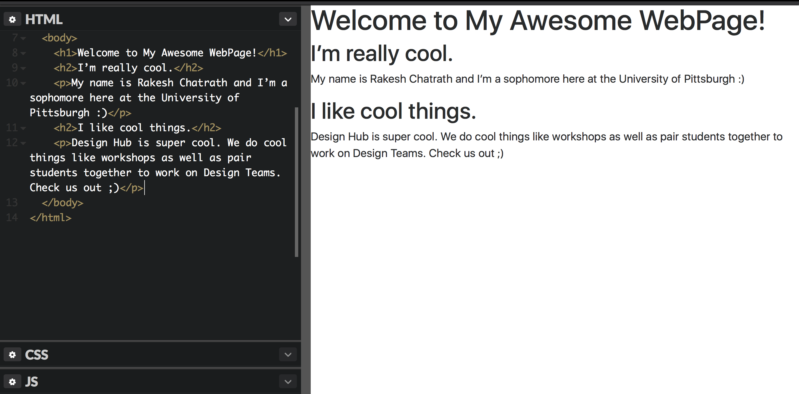

> Note: As you can see, `<p>` vs not having a p tag produces the same output. But for code tidiness and functionality, you should always use `<p>`. There’s no advantage to not using them.

### Links (Anchors)
Sometimes in your markup you may want to link to other websites or content. To do this, we’ll use the `a` or anchor tag.
```html
<html lang=“en”>
  <head>
    <title>My Awesome Web Page</title>
    <link rel=“stylesheet” href=“https://cdnjs.cloudflare.com/ajax/libs/twitter-bootstrap/4.0.0-alpha.6/css/bootstrap.min.css” />
    <script src="https://ajax.googleapis.com/ajax/libs/jquery/3.2.1/jquery.min.js"></script>
  </head>
  <body>
    <h1>Welcome to My Awesome WebPage!</h1>
    <h2>I’m really cool.</h2>
    <p>My name is Rakesh Chatrath and I’m a sophomore here at the University of Pittsburgh :)</p>
    <h2>I like cool things.</h2>
    <p>Design Hub is super cool. We do cool things like workshops as well as pair students together to work on Design Teams. Check us out ;)</p>
    <p><a href=“https://pittdesignhub.com”>Design Hub</a></p>
    <p><a href=“https://www.facebook.com/pittdesignhub”>Facebook</a></p>
    <p><a href=“https://github.com/mike-u/DesignHubWeb”>GitHub</a></p>
  </body>
</html>
```

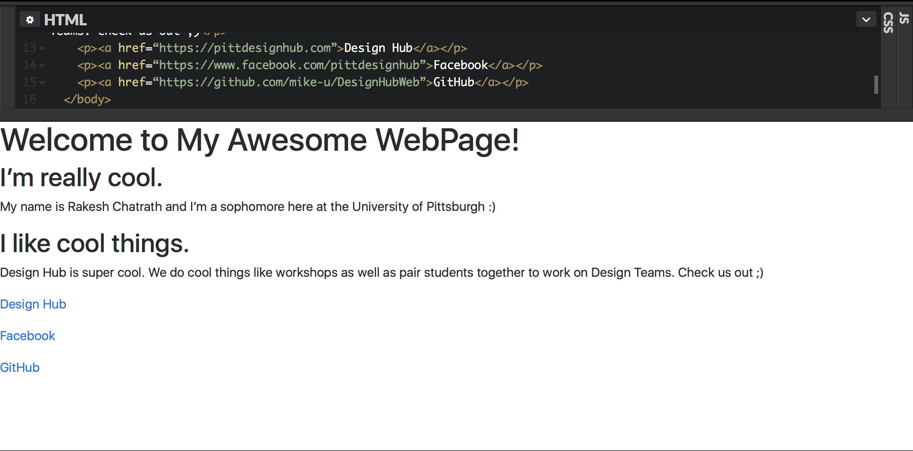

### Unordered Lists and List Items
However, as you can see we have three of essentially the same type of **thing**  in the example with links above. We can group these items into a `unordered list`. HTML provides two basic tags for `lists`: `ul` (`unordered list`) and `li` (`list item`). The `ul` tag can be thought of the container for the list, or the piece of paper if you were to create this list with pen and paper. The `li` tag represents the actual content of the list, the bullet points or what you would write down on pen and paper. Let’s convert our code to use Lists.

```html
<html lang=“en”>
  <head>
    <title>My Awesome Web Page</title>
    <link rel=“stylesheet” href=“https://cdnjs.cloudflare.com/ajax/libs/twitter-bootstrap/4.0.0-alpha.6/css/bootstrap.min.css” />
    <script src="https://ajax.googleapis.com/ajax/libs/jquery/3.2.1/jquery.min.js"></script>
  </head>
  <body>
    <h1>Welcome to My Awesome WebPage!</h1>
    <h2>I’m really cool.</h2>
    <p>My name is Rakesh Chatrath and I’m a sophomore here at the University of Pittsburgh :)</p>
    <h2>I like cool things.</h2>
    <p>Design Hub is super cool. We do cool things like workshops as well as pair students together to work on Design Teams. Check us out ;)</p>
    <ul>
      <li><a href=“https://pittdesignhub.com”>Design Hub</a></li>
      <li><a href=“https://www.facebook.com/pittdesignhub”>Facebook</a></li>
      <li><a href=“https://github.com/mike-u/DesignHubWeb”>GitHub</a></li>
    </ul>
  </body>
</html>
```
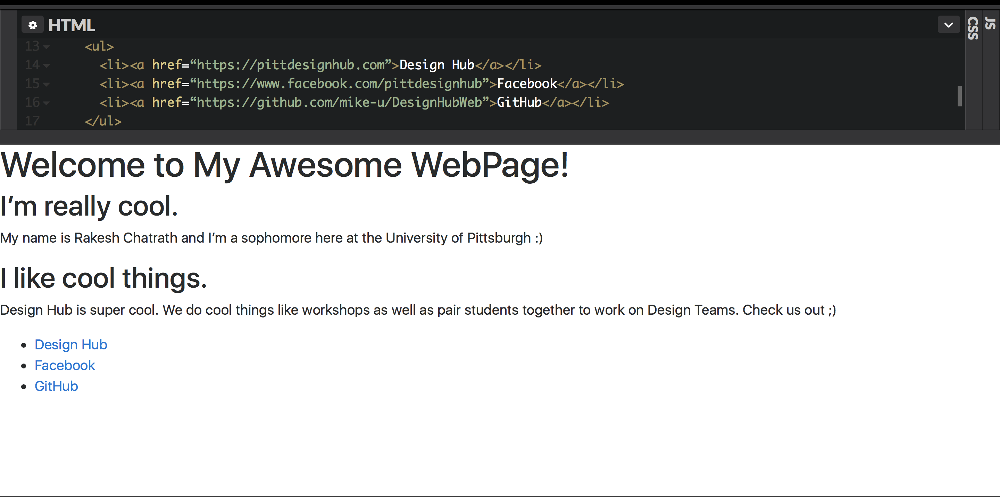

### Images
We can further customize our website by adding images. HTML provides the image tag `img` to use. You can specify URLs or relative paths,  though for succinctness in this workshop we’ll talk about URLs for now.
```html
<html lang=“en”>
  <head>
    <title>My Awesome Web Page</title>
    <link rel=“stylesheet” href=“https://cdnjs.cloudflare.com/ajax/libs/twitter-bootstrap/4.0.0-alpha.6/css/bootstrap.min.css” />
    <script src="https://ajax.googleapis.com/ajax/libs/jquery/3.2.1/jquery.min.js"></script>
  </head>
  <body>
    <h1>Welcome to My Awesome WebPage!</h1>
    <h2>I’m really cool.</h2>
    <p>My name is Rakesh Chatrath and I’m a sophomore here at the University of Pittsburgh :)</p>
    <h2>I like cool things.</h2>
    <p>Design Hub is super cool. We do cool things like workshops as well as pair students together to work on Design Teams. Check us out ;)</p>
    <ul>
      <li><a href=“https://pittdesignhub.com”>Design Hub</a></li>
      <li><a href=“https://www.facebook.com/pittdesignhub”>Facebook</a></li>
      <li><a href=“https://github.com/mike-u/DesignHubWeb”>GitHub</a></li>
    </ul>
    
  </body>
</html>
```

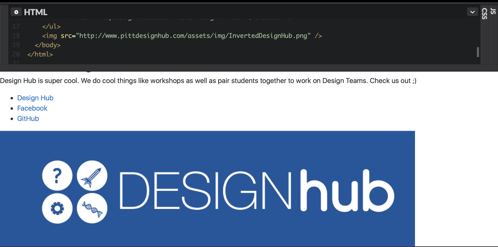

### Divs
Divs are perhaps the most fundamental and most powerful elements in HTML. Div stands for division, and they are elements in HTML that simply divide your HTML page into sections. Almost all web pages are composed of divs, as they allow each portion of a page to be divided and worked on individually. This is the most useful when styling, which we will see later. To see how important divs are, look how Twitter’s web page is divided with respect to divs: each div is outlined in blue.

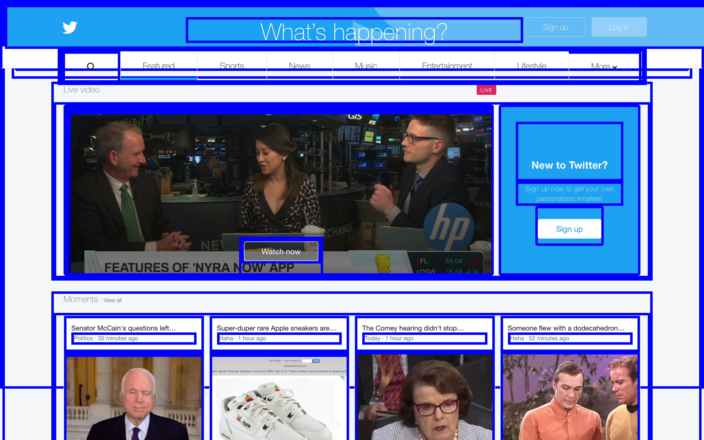

As we can see, Literally everything is encapsulated in its own div. So how do we use divs? We’ll simply use divs to organize our code! While it won’t do anything right now, later when we style we can target these divs to give each section it’s individual style.
```html
<html lang=“en”>
  <head>
    <title>My Awesome Web Page</title>
    <link rel=“stylesheet” href=“https://cdnjs.cloudflare.com/ajax/libs/twitter-bootstrap/4.0.0-alpha.6/css/bootstrap.min.css” />
    <script src="https://ajax.googleapis.com/ajax/libs/jquery/3.2.1/jquery.min.js"></script>
  </head>
  <body>
    <div>
      <h1>Welcome to My Awesome WebPage!</h1>
    </div>
    <div>
      <h2>I’m really cool.</h2>
      <p>My name is Rakesh Chatrath and I’m a sophomore here at the University of Pittsburgh :)</p>
    </div>
    <div>
      <h2>I like cool things.</h2>
      <p>Design Hub is super cool. We do cool things like workshops as well as pair students together to work on Design Teams. Check us out ;)</p>
      <ul>
        <li><a href=“https://pittdesignhub.com”>Design Hub</a></li>
        <li><a href=“https://www.facebook.com/pittdesignhub”>Facebook</a></li>
        <li><a href=“https://github.com/mike-u/DesignHubWeb”>GitHub</a></li>
      </ul>
    </div>
    <div>
      
    </div>
  </body>
</html>
```

### Comments
Lastly, like most programming languages, HTML provides the ability to comment code. Comments are delimited by `<!-- -->` in HTML. Comments are good for explaining code in your markup, but will not appear in your rendered document.
```
<h1>Hi</h1>
<!-- This is a comment. I’m not gonna appear anywhere except for here.
I can span multiple lines -->
<h1>Bye</h1>
```
## CSS
CSS stands for Cascading Style Sheets. It is used to style your web pages. CSS is incredibly powerful and there’s a ton of things you can do with it. However, in this workshop we’ll start with the absolute basics to get the feel of what you can do with CSS.
### Getting Started
CodePen makes it relatively easy to add style to your web pages. In CodePen, all you need to do is to type your CSS code into the `CSS` pane, and it’ll automatically update your project with your  newly added styles. However, when you’re not working in CodePen, you can add your CSS work to your project in much the same way we added Bootstrap earlier; in fact when we loaded Bootstrap, all we were doing was linking the project to a remotely hosted CSS file. In this case, we want our pointer to be at a local file, saved in the same project as our html. It might look something like this:
```html
<link rel=“stylesheet” href=“assets/css/style.css” />
```
Of course, how you setup your project will vary, but that’s the general format for using `relative paths`. Instead of specifying a URL, we’re specifying a path on your computer to the CSS file.
> Note: When working on projects and deploying them for other people to use, you may run into difficulty with your CSS not showing up. We’ll touch on this in the [Hosting](#hosting) section in more detail.
### First Styling
CSS essentially works by defining a bunch of rules for your HTML elements. In fact, we can change just about any attribute for any element in HTML just with pure CSS code. The general structure is as follows:
```css
selector {
  pointer: ...;
}
```
Selector refers to the HTML element you want to select. Pointer refers to the attribute you want to define a rule for. The ellipses are the definition of that rule. Let’s look at a rudimentary example. Supposed I wanted to make all the titles in our be emphasized a little bit more. To do this we want to *select* all the `h2` elements in our project, and then *point* to the text attribute of that element. If we wanted to make the text italics and purple we could do something like this:
```css
h2 {
  font-style: italics;
  color: purple;
}
```
Here we are telling CSS that for all `h2` elements, we want to adjust the rules for the `font-style` and the be `color` of that element. In this case, we’re defining the rule to be italic and purple respectively.
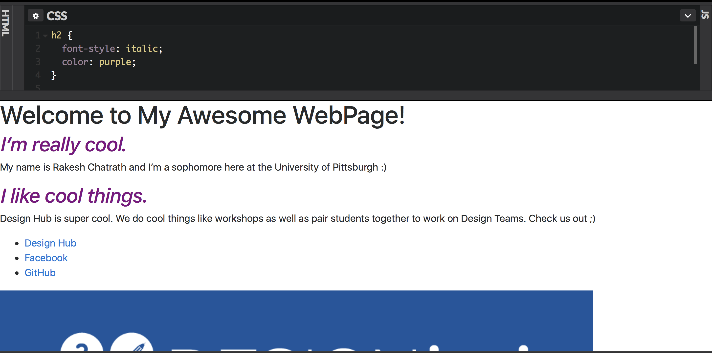

> Note: For every selector, CSS has a wide variety of pointers you can set rules for. By no means do you need to have all these or even any memorized. Using tools like w3 to look things up is all you might need. However you might want to remember how to define styles for relatively common things, like width, height, color, etc.

### Classes
Often times, you’ll want to be able to style the same component differently within your HTML page. In fact, you might even want to have many of the same element with one style and many of the same element with another style. One of the most common examples is with the `a` tag. Suppose we’re building a video sharing website: we might want to have an `a` tag to allow a user to subscribe, but if they’re already subscribed, we might want to change that `a` to unsubscribe. However, to make things clearer to the user what action we’re performing, we’d want to have some stylistic difference between subscribing and unsubscribing. Enter CSS classes.

All HTML elements can have a class, like so:
```html
<a href=... class=“class1 class2 ...”>Some Link</a>
```
In our extremely rudimentary example above, we might want to have two CSS classes for different colors for the anchor whether they are subscribed or not:
```css
.info {
  color: blue;
}

.danger {
  color: red;
}
```
By default, our user isn’t subscribed to the content creator, and so we’d want the link to be colored blue, like so:
```html
<a href=... class=“info”>Subscribe</a>
```
However, once they subscribe, we want them to know that the link is now dangerous and will unsubscribe them, so we’ll change the `a` tag’s class to `danger`:
```html
<a href=... class=“danger”>Unsubscribe</a>
 ```
> Note: To recap, all HTML elements with the class `info` in our example above will have the text color as `blue` and all HTML elements with the class as `danger` will have the text color of `red`.

### More Useful Styling
Like we alluded to earlier, divs are incredibly versatile for styling. A common look in webpages like ours is to have the whole thing horizontally centered on the page. Let’s use divs and CSS classes to center our content on the page. This is easier than it might seem. First let’s mock up our CSS. We’ll create a new css classes called `centered`.
```css
.centered {
  width: 50%;
  margin-left: auto;
  margin-right: auto;
}
```
In order to use this class, let’s wrap our whole web page in a div and give it the `centered` class.
```html
<html lang=“en”>
  <head>
    <title>My Awesome Web Page</title>
    <link rel=“stylesheet” href=“https://cdnjs.cloudflare.com/ajax/libs/twitter-bootstrap/4.0.0-alpha.6/css/bootstrap.min.css” />
    <script src="https://ajax.googleapis.com/ajax/libs/jquery/3.2.1/jquery.min.js"></script>
  </head>
  <body>
    <div>
      <h1>Welcome to My Awesome WebPage!</h1>
    </div>
    <div>
      <h2>I’m really cool.</h2>
      <p>My name is Rakesh Chatrath and I’m a sophomore here at the University of Pittsburgh :)</p>
    </div>
    <div>
      <h2>I like cool things.</h2>
      <p>Design Hub is super cool. We do cool things like workshops as well as pair students together to work on Design Teams. Check us out ;)</p>
      <ul>
        <li><a href=“https://pittdesignhub.com”>Design Hub</a></li>
        <li><a href=“https://www.facebook.com/pittdesignhub”>Facebook</a></li>
        <li><a href=“https://github.com/mike-u/DesignHubWeb”>GitHub</a></li>
      </ul>
    </div>
    <div>
      
    </div>
  </body>
</html>
```

And voila! Our page is now horizontally centered.

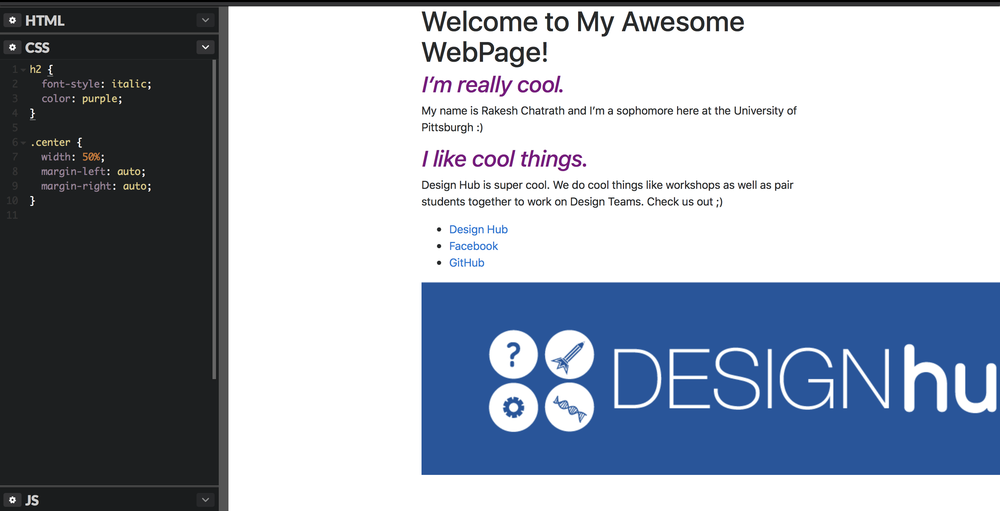

Let’s break down what we did here:

* We set `width: 50%`

This might seem like magic, but in CSS selector classes have a parent-child relationship. Children classes inherit attributes from their parent by default. We won’t go more into class inheritance here, but it’s extremely powerful. In this case, `.centered` is inheriting attributes from `body` which in turn inherits special attributes from `html`. These two tags are special and have default styles in CSS.  By setting the `width` to `50%`, we told CSS that anything with the `.centered` class should have a width that is 50% of the body (whose width is the whole screen, however large that might be in terms of pixels).

Next, we set values for the left and right margins:

* `margin-left: auto`
* `margin-right: auto`

This might also look like CSS magic, but what these attributes say is to make the margins as large as possible such that the content still fits on the screen. Therefore, the left and right margins have a width of 25%, automatically centering the div on the page. Had we set only one of the margins, we’d push our `.centered` div to the other side of the page, as that margin would have a width of 50%.

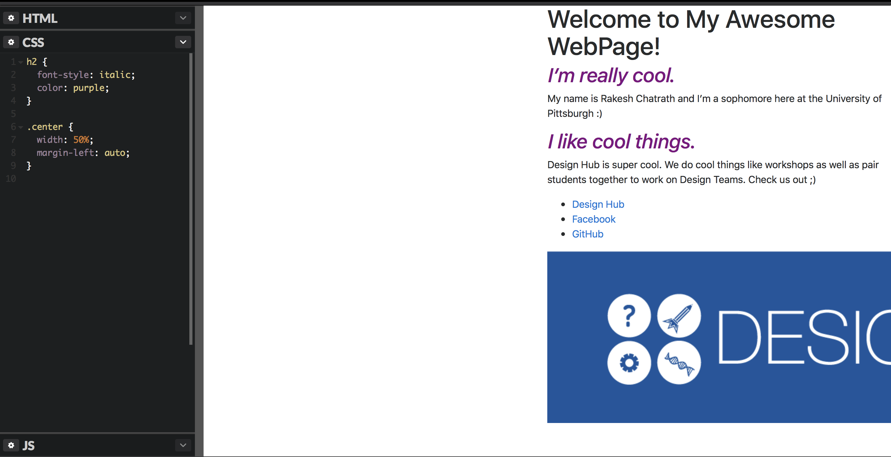

> Note: We just went through all the theory of how margins work with CSS. It’s a good idea to memorize how centering a page works, as it’s a very popular design in current web development.

However, we can do a little bit better. Let’s continue tidying up our pages by adding a bit of space between the text and the div as well as center our titles. In this case, we don’t need to adjust our HTML at all. Let’s just edit the CSS.

```css
h2 {
  font-style: italic;
  color: purple;
  text-align: center;
}

h1 {
  text-align: center;
}

.centered {
  width: 50%;
  margin-right: auto;
  margin-left: auto;
  padding: 15px;
}
```
We can easily center any form of text (`<p>`, `<h1-6>`, `<a>`) horizontally on the page with the attribute `text-align: center`.  For the `.centered` class, we added `padding: 15px`. This attribute is exactly what it sounds like: it adds the designated amount of pixels in between the elements inside the div and the divs’ edges, essentially creating a mini border inside the div.
> Note: Like margin, you can specify the padding individually for each side of the div. In this case, we wanted the padding on every side, so we used a shortcut with just `padding: ...`. What this actually does is produce the four following commands:
> * `padding-top: ...`
> * `padding-left: ...`
> * `padding-right: ...`
> * `padding-bottom: ...`
> Any pointer that can be applied to all sides of a div has this shortcut, including margin.

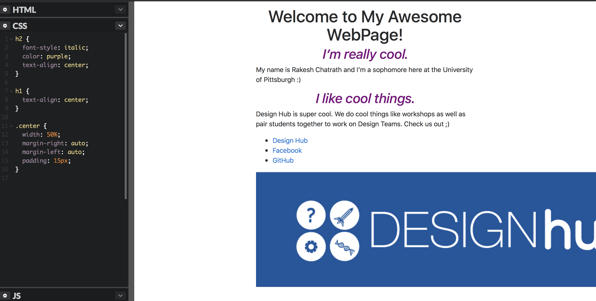

Finally, let’s fix our image so that it’s width is constrained to the size of our centered div. To do this, we’ll need one more CSS classes:
```css
.constrain-width {
  max-width: 100%;
}
```
This class is for our image itself. With this, we’re telling CSS that whatever has this class cannot have a width larger than the width of its parent, in this case the div it’s wrapped in which has the width of `.centered`.  You might be wondering why we don’t just apply that property to the div it’s wrapped in. CSS and HTML are flexible, they allow the contents of a div to **overflow** out of the divs containing them, so as not to cut off that element.

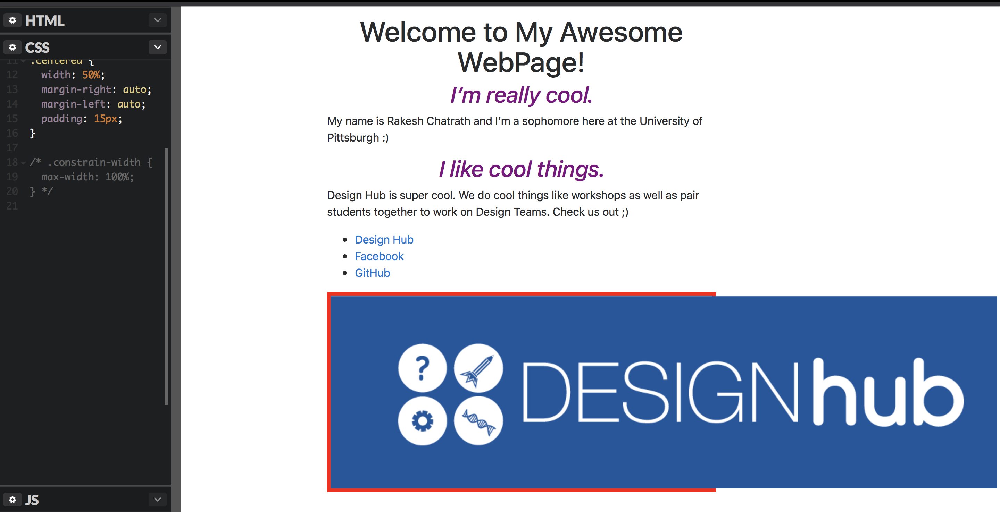

There are many ways to dealing with overflow (for example allowing the div to be scrollable, which can be set for both horizontal and vertical scrolling), but we won’t worry too much about it now. In this case, the actual size of the image is larger than our div, so we need to constrain it such that the largest it can be is the size of our div.

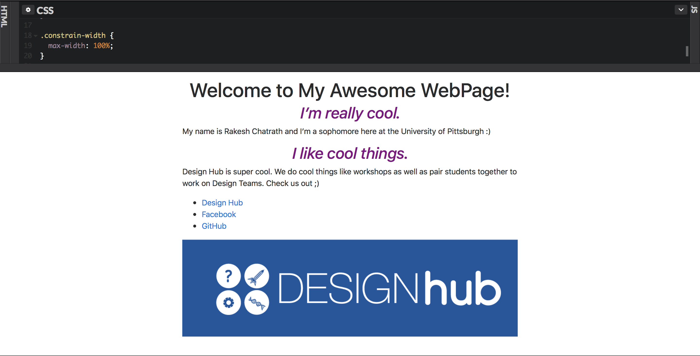
> Note: This trick we did to resize the image can work if it’s too small, too. `max-width` has a sister property called `min-width` and so if our image was too small, we could make it be the size of the div by using that property. These properties are also available for `height`, too.

### The Wonderful World of CSS
CSS has manyyyy things to learn. It’s incredibly powerful and versatile. Here are some links with essential CSS information for further learning:
* [Cascading Styles](https://developer.mozilla.org/en-US/docs/Web/CSS/Cascade)
* [Box Model](https://www.w3schools.com/css/css_boxmodel.asp)
* [Positioning](https://www.w3schools.com/css/css_positioning.asp)
* [Floats](https://www.w3schools.com/css/css_float.asp)
* [Selectors](https://www.sitepoint.com/web-foundations/css-selectors/)

Once you understand a lot of the fundamentals of CSS and have gotten used to using it a lot, you might be interested in improving your workflow (CSS can be very frustrating to actually type!). There are CSS preprocessors that give more versatile and friendly tools to make writing CSS easier. Essentially they transpile into CSS, that you can throw into your web page. You should look at these after you feel very confident in your CSS abilities, they’ll make your life easier!
* [Sass  (SCSS)](http://sass-lang.com)
* [Less](http://lesscss.org/)

## Javascript
Javascript is the programming language of the web -- it allows you to do incredibly complex and dynamic things with your web pages. MDN describes JS exceptionally:
> JavaScript is a programming language that enables you to create dynamically updating content, control multimedia, animate images, and pretty much everything else. Ok, not everything, but it is amazing what you can achieve with a few lines of JavaScript code.

With that said, Javascript has a very complex and diverse ecosystem -- much more so than CSS or HTML. This workshop is just meant to show you what JS is, not even to show you what it can do, as there are an endless amounts of things. With that said, as with CSS and HTML, we can use Javascript directly in CodePen by typing in the Javascript pane.
### A Rudimentary Example
So what is something we can do with Javascript in our basic web app? Well,  lots of things. But, for now let’s try to hide and show our image by clicking a link. First, let’s create two HTML links that we’ll use to start adding functionality.
```html
<html lang=“en”>
  <head>
    <title>My Awesome Web Page</title>
    <link rel=“stylesheet” href=“https://cdnjs.cloudflare.com/ajax/libs/twitter-bootstrap/4.0.0-alpha.6/css/bootstrap.min.css” />
    <script src="https://ajax.googleapis.com/ajax/libs/jquery/3.2.1/jquery.min.js"></script>
  </head>
  <body>
    <div>
      <h1>Welcome to My Awesome WebPage!</h1>
    </div>
    <div>
      <h2>I’m really cool.</h2>
      <p>My name is Rakesh Chatrath and I’m a sophomore here at the University of Pittsburgh :)</p>
    </div>
    <div>
      <h2>I like cool things.</h2>
      <p>Design Hub is super cool. We do cool things like workshops as well as pair students together to work on Design Teams. Check us out ;)</p>
      <ul>
        <li><a href=“https://pittdesignhub.com”>Design Hub</a></li>
        <li><a href=“https://www.facebook.com/pittdesignhub”>Facebook</a></li>
        <li><a href=“https://github.com/mike-u/DesignHubWeb”>GitHub</a></li>
      </ul>
    </div>
    <div>
      
      <!-- By default, we want to show the banner, keep the link hidden for now -->
      <a href=‘#’ id=“showBanner” onClick=“showBanner()” style=“display: none”>Show Banner</a>
      <a href=“#” id=“hideBanner” onClick=“hideBanner()”>Hide Banner</a>
    </div>
  </body>
</html>
```
There’s a few important things we’re doing here. First, with anchors, if you set `href=‘#’`, then when you click the link it will not redirect you anywhere, and you can use the click as an easy way to add functionality. Second, we assigned an ID to each of the links. This is especially important as now we can easily select elements in our Javascript. Third, one of the HTML attributes we added was `onClick`; this is exactly what it sounds like: when a user clicks the link it will do something, in this case call a function we’ll define in our Javascript. Finally, in the first the link we used inline styling (generally bad practice but for this example we’ll let it slide ;) ) to set the `display` pointer to `none`. This essentially keeps that element hidden from the web page. Now, let’s add some Javascript to make this functional.
```js
var showBanner = function()  {
  // Get Banner and Links
  var banner = document.getElementById(“banner”);
  var showLink = document.getElementById(“showBanner”);
  var hideLink = document.getElementById(“hideBanner”);

  // Show Banner
  banner.style.display = “block”;

  // Hide Show Banner Link
  showLink.style.display = “none”;

  // Show Hide Banner Link
  hideLink.style.display = “inline”;   
}

var hideBanner = function() {
  // Get Banner and Links
  var banner = document.getElementById(“banner”);
  var showLink = document.getElementById(“showBanner”);
  var hideLink = document.getElementById(“hideBanner”);

  // Hide Banner
  banner.style.display = “none”;

  // Hide Hide Banner Link
  hideLink.style.display = “none”;

  // Show Show Banner Link
  showLink.style.display = “inline”;   
}
```

This piece of Javascript does a few things: it assigns functions, gets HTML elements, and adjusts the style of those elements. Javascript has the ability to get information about the document it is in. The special variable `document` essentially represents your HTML page. By assigning IDs to our elements we can find which element we want to access and then adjust it’s properties. In essence, we returned the `showBanner` and `hideBanner` links within Javascript, and then accessed their `style` property, which in term had a `display` property that we either set to `none` or `inline` depending on what we were doing. And with that, we’ve added functionality to hide or display our banner at the click of a link.
> Note: This by no means was the most efficient or proper way to add this functionality. A neat thing about JS is that there are MANY ways to do the same things: this way was chosen because it covered a lot of basics about JS and is simple to understand. Javascript has a very rich ecosystems; there are many frameworks building off Javascript that essentially define different ways to do the same thing. When you start to get more into Javascript you should find what works best for you according to your requirements and how efficiently you can produce the code. But, just like CSS, a solid foundation in Javascript will go a much longer way as frameworks dip in and out moreso than any other language.

### Going Further
As with CSS, there is an abundance of more things to learn with Javascript. Instead of giving you a list of things to go after this time, I’m giving a different a recommendation. Javascript simply has too many features for you to ever use all of them. Instead start building things. Try experimenting with different basic ideas: like making a clock/timer, a portfolio, or whatever random idea you have. As you have questions of functionality you have in mind, look at the Javascript docs and Google things to find your answer. I recommend trying to program everything yourself in pure Javascript, devoid of any frameworks, but if you get really stuck, StackOverflow is great. Once you’ve gotten a decent feel for JS, turn to some resources about what you should study like Quora and StackOverflow questions, curated lists, Scotch.io and of course MDN and W3Schools. Finally, start to dip your toes in JS frameworks/libraries. As you get more engrossed in web development, it might seem like everyone is talking about Node.js, React, or Angular -- it doesn’t hurt to get your hands wet with some of these technologies (they can be extremely powerful, if a bit confusing/complex at first.

## Hosting
This section is all about hosting. But what is hosting? Well at some point if you decide to want to work on your machine and move past CodePen (as you most likely will once you’re more experienced) then you need to somehow make your code available. This is called Hosting. There are a lot of great tools now to get your projects up without having to pay for expensive servers such as `Heroku` or `Pancake` but for now we’ll talk about Github Pages. Github Pages is a tool that allows you to host web pages directly from your Git repo.

> Note: All instructions here can be found at https://pages.github.com.

First thing you’ll need to do is create a GitHub account. Go too https://www.github.com to sign up for free. Once you have an account made, create a new repo with the title `username.github.io` where username is **your** username.
> GitHub pages will not work if the repo name isn’t exactly the same as your username.

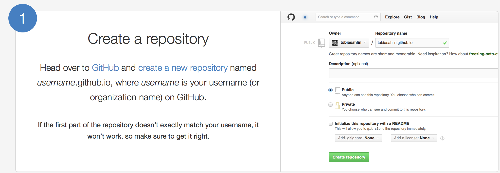

Next clone the repo onto your machine by typing this into your terminal:

```bash
git clone https://github.com/username/username.github.io
```

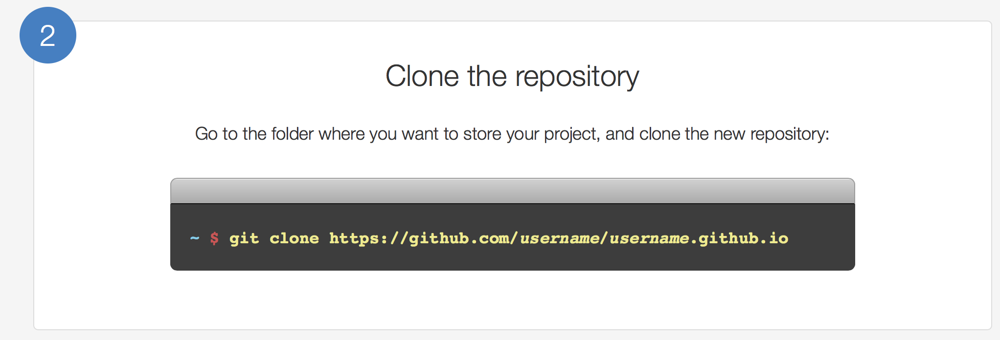

Once you’ve cloned the repo, move into that directory and create a new file called `index.html`. This file will be used for your HTML markup. Finally, add the file to the repo, make a commit and push the commit to your repo.

```bash
~$ git add --all
~$ git commit -m "Initial commit"
~$ git push -u origin master
```

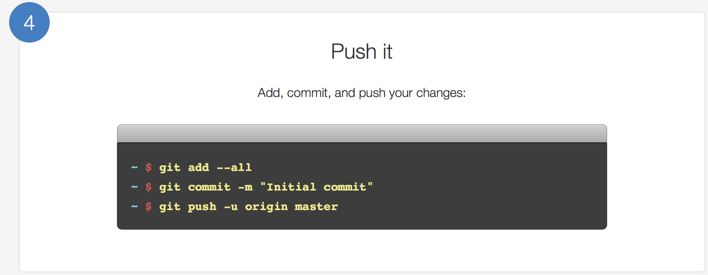

And that’s it! Your webpage should be visible at http://username.github.io.

> Note: To serve CSS and Javascript files (referred to as static files), GHPages has a particular syntax. Within the **same** directory as your `index.html` file, create two new directories called `css` and `js`. In those directories, put your css and javascript files. Your directory structure should be as follows.

```
username.github.io
  css/
    style.css
  js/
    app.js
  LICENSE.txt
  README.md
  index.html
```

> Note: Remember to link the relative paths in your index.html, `<link href=“/css/style.css” ... />` and `<script src=“/js/app.js” ... ></script>`.

## Next Steps
We just went through A LOT of material. But in doing so we’ve gone through essentials for getting started in web development, including HTML, CSS and Javascript. As in the Javascript section, I recommend building simple web applications, Googling things as you go.  In programming especially, there’s no better way to learn than to do. However, if you’re looking for something more structured, here are some great resources:
* [Free Code Camp](www.freecodecamp.com)
* [Coding Dojo](www.codingdojo.com)
* [Coursera](www.coursera.com)

And, of course, the developer resources listed at the beginning of this article are some of the most excellent resources for you to use.

In the future, Design Hub plans on offering more web development based workshops, so come to those to learn about more advanced web development concepts! Or, if you have any questions, feel free to email me [rchatrath7@pitt.edu](mailto://rchatraht7@gmail.com).

Keep on Hacking!
